# CHPC: Cheap Heat Pump Controller

Firmware for a low-cost heat pump (HP) controller built on an Arduino Pro Mini (ATmega328P, 5 V / 16 MHz) and the CHPC v1.3 PCB. It runs a ground-source heat pump that feeds an in-floor heating loop.

This repository is a fork of [gonzho000/chpc](https://github.com/gonzho000/chpc). It changes the firmware for one specific installation. The main changes are:
- remote control over RS-485 by an ESP32 master controller;
- a configurable power limit;
- adjustable minimum and maximum opening of the electronic expansion valve (EEV);
- frost protection;
- faster response on the bus;
- a Wokwi simulation for testing without hardware.

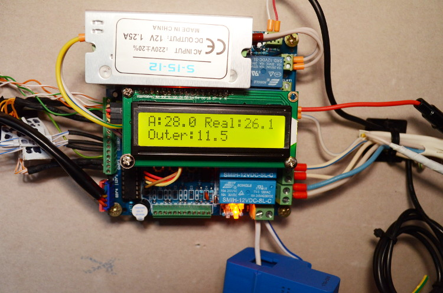

## What the controller drives

| Output | Pin | Function |
|---|---|---|
| Relay: compressor | D8 | heat pump compressor |
| Relay: hot-side pump | D7 | circulating pump of the heating (floor) loop |
| Relay: cold-side pump | D10 | circulating pump of the ground loop |
| Relay: sump heater | D11 | compressor crankcase heater |
| Relay: 4-way valve | D9 | reserved, always off |
| EEV | D2–D5 | stepper-driven electronic expansion valve |
| Buzzer | D6 | error signal |

| Input | Pin | Function |
|---|---|---|
| DS18B20 bus | D12 | up to 12 temperature sensors on one OneWire bus |
| Current transformer | A6 | compressor power measurement (RMS, 230 V assumed) |
| Flow sensor | A7 | above 4 V = no flow |
| Buttons | A2 `<`, A3 `>`, A1 `menu` | local settings (pull-down resistors required) |
| LCD 16x2 | A4/A5 (I2C, 0x27) | local display |
| RS-485 | D0/D1 (hardware UART) | 9600 baud, 8N1 |

## Temperature sensors

Sensors are identified by their 1-Wire address. The addresses are learned on first start (see [First start](#first-start-sensor-discovery)) and stored in EEPROM.

| Abbr. | Position | Used for |
|---|---|---|
| Tae | after evaporator | EEV superheat, suction anti-freeze **(required)** |
| Tbe | before evaporator | EEV superheat **(required)** |
| Ttarget | heated water / floor loop | thermostat: start and stop of the compressor **(required)** |
| Tsump | compressor sump | sump heater, compressor over- and under-temperature |
| Tci / Tco | cold loop in / out | ground loop anti-freeze |
| Thi / Tho | hot loop in / out | hot-side overheat, hot pump run-on |
| Tbc | before condenser (discharge) | discharge overheat |
| Tac | after condenser | information only |
| Touter | outdoor | information only |
| Tcwu | domestic hot water | information only |

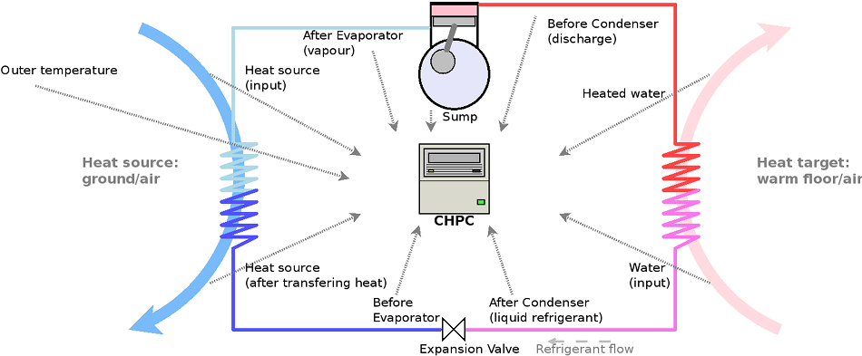

## How it works

### Start-up
1. The relays are switched off and the LCD and RS-485 are initialised. The LCD shows `ID: 0x41`.
2. The sensor addresses and settings are read from EEPROM. On a fresh board, sensor discovery runs instead.
3. The EEV is fully closed to calibrate its position, then opened to the waiting position.
4. For **90 s** the compressor is not allowed to start. The LCD counts down (`Wait: N s.`). RS-485 already answers during this time.

### Compressor control (thermostat)
The compressor **starts** when all of the following are true:
- `CO` (heating) is on and there is no error;
- the compressor has been off for at least **20 min**;
- `Ttarget` < `T max − delta` (the `T min` shown on the LCD). With force start (`F`), `Ttarget` < `T max − 3 °C` is enough;
- the protections allow it:
  - Tsump between 5 and 85 °C;
  - Tae > −2 °C;
  - Tbc < 70 °C;
  - Tci and Tco > −2 °C;
  - the EEV is at least in its waiting position.

The compressor **stops** when `Ttarget` > `T max` (or `CO` is switched off), after running for at least **3 min**.

### Circulating pumps
- **Hot-side pump:** on 2.25 s after the compressor starts. After the compressor stops, it keeps running for **60 s**, and longer while `Tho` > `Ttarget` + 3 °C.
- **Cold-side pump:** on 2.25 s after the compressor starts. It stops 10 s after the compressor stops, once Tbe and Tae are above 0 °C.
- **Sump heater:** on while Tsump < 10 °C.
- **Frost protection:** while the compressor is off, the hot-side pump runs when any connected sensor reads ≤ 0 °C. It stops once all sensors are ≥ 2 °C.
- **Manual override:** each pump and the sump heater can be forced on from the buttons or over RS-485.

### EEV (electronic expansion valve)
The valve keeps the **superheat** (Tae − Tbe) at the setpoint `EEV Td` (default 1.0 K, range 0–8 K):
- **Superheat too low:** the valve closes one step at a time.
- **Superheat above setpoint + 0.2 K:** the valve opens slowly (one step per 40 s).
- **Superheat above setpoint + 4.2 K:** the valve opens fast (one step per 1.3 s).
- **Emergency close:** the valve closes fast when superheat < 0.2 K, Tae < 0.2 °C, or Tci/Tco < 0 °C.
- **Limits while the compressor runs:**
  - **minimum** opening `EEV min`: default 49 steps, settable 25 up to max − 1 from the buttons, or from the web app Settings tab (RS-485 `0x0F`);
  - **maximum** opening `EEV`: default 67 steps, settable min + 1 up to 480.
- **While the compressor is off:** the valve waits in the **waiting position**, which is always below the minimum: `min(45, EEV min − 4)`.
- **Recalibration:** every 24 h of idle time the valve is fully closed to recalibrate its position.

### Protections

| Code | Condition | Reaction | LCD |
|---|---|---|---|
| 1 | Required sensor missing (reads −127) | compressor stops, buzzer every 33 s. Cleared automatically when the sensor comes back | `ERR: Temp. Sens.` |
| 2 | Power above the power limit (after 9 s from start, or above 3.5× the limit at any time) | compressor stops, error counted | `ERR: Overload` |
| 3 | No flow on the flow input, 50 s after start. **Active only when the power limit is above 3200 W** | compressor stops, error counted | `ERR: Cold Flow` |
| 4 | Power below `power limit / 3.5`, 60 s after start (compressor not working) | compressor stops, error counted | `ERR: Wattage Min` |
| 5–9 | Tho > 60 °C, Tsump > 85 °C, Tbc > 70 °C, Tae < −2 °C, Tco < −2 °C while running | compressor stops | `ERR: Temp. Tho` / `Tsump` / `Tbc` / `Tae` / `Tco` |
| 10 | Power drawn while the compressor is off (stuck relay) | pumps forced on | `ERR: Relay` |
| 11 | 5 counted errors | control locks. RS-485 keeps answering, so the lock shows in the web app and can be cleared there ("Odblokuj", command `0x10`) or with a restart. The counter also resets after a normal compressor cycle | `ERR: Locked x5` |
| 12 | Tsump < 3 °C, 60 s after start | compressor stops | `ERR: Temp. Low` |

Every event is reported in the status JSON (`ERR` code, `ERRn` sequence number, `ERRc` error counter). The web app keeps a history of errors with their times.

The **power limit** also works as a switch for the flow protection. Setting it to exactly 3200 W disables that protection, for example when the pump runs from a power source on which the flow sensor is unreliable.

## Local operation (LCD and buttons)

The LCD shows three screens in turn, each for 5 s:

| Screen | Line 1 | Line 2 |
|---|---|---|
| 1 | `CO:` T min / T max | `T CO:` Ttarget |
| 2 | `Be:` Tbe `Ae:` Tae | `dT:` superheat, `E:` EEV position (`+`/`−` while moving) |
| 3 | `HP:` Tsump, `Co:` Tco (or `Ho:` Tho) | `W:` power, `F` = force start, `Flow:0/1` |

`menu` selects the next setting, and `<` / `>` change it. Held buttons repeat every 0.75 s.

| # | LCD | Setting | Step, range | Saved in EEPROM |
|---|---|---|---|---|
| 0 | `CO:` | heating on/off | 0/1 | yes |
| 1 | `T max:` | stop temperature | 0.5 °C, 1–50 °C | yes |
| 2 | `T min:` | start temperature (T max − delta) | 0.5 °C | yes |
| 3 | `EEV:` | EEV maximum opening | 1 step, min+1 to 480 | yes |
| 4 | `EEV Td:` | superheat setpoint | 0.1 K | yes |
| 5 | `H POMP:` | force hot-side pump on | 0/1 | no |
| 6 | `C POMP:` | force cold-side pump on | 0/1 | no |
| 7 | `HEATER:` | force sump heater on | 0/1 | no |
| 8 | `WATT:` | power limit | 50 W, 914–4000 W | yes |
| 9 | `EEV min:` | EEV minimum opening (waiting position follows it) | 1 step, 25 to max−1 | yes |

## Remote operation (RS-485)

The controller is a slave (address `0x41`) on an RS-485 bus. The bus master is a separate ESP32 controller. It polls the heat pump every 10 s while running and every 30 s when idle, forwards the data to a cloud service, computes COP and sends settings back. The same bus also carries Modbus traffic to the PV inverters (address `0x69`), which the controller ignores.

**Request:** 5 bytes, `[0x41] [cmd] [d1] [d2] [0xFF]`. Decimal values are sent as whole part and hundredths (45.5 → `45, 50`). Power is sent as W/100 and W%100 (3800 W → `38, 0`). Several frames that arrive back to back are all processed.

| cmd | Meaning | Data |
|---|---|---|
| `0x01`, `0x02` | return status JSON | — |
| `0x03` | force start | `d1` = 0/1 |
| `0x04` | T max | decimal, 0–50 °C |
| `0x05` | delta (T max − T min) | decimal, 0–30 °C |
| `0x08` | EEV superheat setpoint | decimal |
| `0x09` / `0x0A` / `0x0B` | force hot pump / cold pump / sump heater | `d1` = 0/1 |
| `0x0C` | heating (CO) on/off | `d1` = 0/1 |
| `0x0D` (`0x07`) | EEV maximum opening | `d1` = steps, 26–255. If it is ≤ EEV min, EEV min drops to max − 1 |
| `0x0F` | EEV minimum opening | `d1` = steps, 25–255. If it is ≥ EEV max, EEV max rises to min + 1 |
| `0x0E` | power limit | W, 1001–4000; other values are ignored |
| `0x10` | unlock | clears the error counter and the `Error x5` lock |
| `0x11` | restart | software restart: relays off, start-up from scratch (90 s pause) |

**Response to `0x01`:** one line of JSON:

```json
{"Tbe":"2.0","Tae":"5.0","Tco":"0.0","Tho":"0.0","Ttarget":"30.0","Tsump":"0.0","EEV_dt":"0.0",
 "Tmax":"30.0","Tmin":"25.0","Watts":"0","EEV":"1.0","EEV_pos":"0","EEV_pulse":"0",
 "SHS":0,"HCS":0,"CCS":0,"HPS":0,"F":0,"CO":1,"WWatt":"3200","EEVmax":"67","EEVmin":"49","ERR":0,"ERRn":0,"ERRc":0,"lt_pow":"0","lt_hp_on":"0"}
```

| Key | Meaning |
|---|---|
| `Tbe`, `Tae`, `Tco`, `Tho`, `Ttarget`, `Tsump` | temperatures, °C |
| `EEV_dt` | current superheat |
| `Tmax`, `Tmin` | thermostat limits |
| `Watts`, `WWatt` | current power, power limit |
| `EEV`, `EEV_pos`, `EEV_pulse`, `EEVmax`, `EEVmin` | superheat setpoint, valve position, pending steps, maximum and minimum opening |
| `ERR`, `ERRn`, `ERRc` | last error code (see the protections table), event sequence number, error counter (5 = locked) |
| `HPS`, `HCS`, `CCS`, `SHS` | compressor, hot pump, cold pump, sump heater (1 = on) |
| `F`, `CO` | force start, heating on |
| `lt_pow` | energy used in the current or last compressor run, Wh |
| `lt_hp_on` | length of the current or last compressor run, s |

## First start: sensor discovery

On a new board (or after changing `MAGIC` in the source) the controller learns the sensor addresses. Connect **one sensor at a time**, when the LCD asks for it:
- `Insert Tae`: connect the sensor. The LCD shows its address, then `OK! Remove Tae`. Disconnect it.
- `Press > to skip`: optional sensor. Press `>` to skip it, or connect it.
- Tae, Tbe and Ttarget are required. The order is Tae, Tbe, Ttarget, Tsump, Tci, Tco, Thi, Tho, Tbc, Tac, Touter, Tcwu.

After the last sensor, connect all of them together. On later starts the addresses are read from EEPROM. A sensor that no longer matches its address shows `Err, s.: <name>`.

## Building and flashing

The project uses [PlatformIO](https://platformio.org/):

```sh
pio run                                   # build
pio run -t upload --upload-port COM3      # flash (disconnect RS-485 first: it shares pins 0/1)
pio device monitor                        # serial console, 9600 baud
```

Compile-time options are at the top of [src/CHPC_firmware.ino](./src/CHPC_firmware.ino):
- `USER OPTIONS`: display, buttons, EEV support;
- `TEMPERATURES`: protection thresholds;
- `TUNING OPTIONS`: timings, EEV and power limits.

## Tests

Full description of the tests, what each suite checks and how to run them: **[test/README.md](./test/README.md)** (in Polish).

**Firmware simulation on the PC (Unity).** The unmodified firmware is compiled on the PC against hardware mocks ([test/sim_env/](./test/sim_env/)):
- virtual clock;
- DS18B20 sensors that can be plugged in and out;
- RS-485 UART;
- current transformer with a 50 Hz sine;
- EEPROM, LCD and buttons.

Six scenario suites (44 tests) cover:
- sensor discovery and EEPROM;
- the start-up pause;
- the thermostat cycle, pumps and EEV;
- all RS-485 commands;
- every protection and error code;
- the error lock, unlock and restart;
- frost protection and the buttons.

```sh
pio test -e native
```

**Full chain.** [test/e2e/](./test/e2e/) connects:
- the simulated firmware;
- the real logic of the ESP32 master controller;
- a local copy of the web app, including controller registration and the UI.

See [test/README.md](./test/README.md#2-cały-łańcuch-e2e) for how to run it and [docs/raport-testow/](./docs/raport-testow/) for the latest results.

## Simulation (Wokwi)

[test-wokwi/](./test-wokwi/) contains a [Wokwi](https://wokwi.com/) project with the same wiring (an Arduino Nano stands in for the Pro Mini) and test scenarios. Wiring, scenarios, installation of `wokwi-cli` and the CI token, and how to run them: **[test-wokwi/README.md](./test-wokwi/README.md)** (in Polish).

| Scenario | Checks |
|---|---|
| `scenario.yaml` | sensor discovery, RS-485 commands, EEPROM after reset, back-to-back frames |
| `scenario-eev-min.yaml` | EEV minimum and maximum: buttons, RS-485 `0x0F`/`0x0D`, limits adjusting each other |
| `scenario-frost.yaml` | frost protection |
| `scenario-sensor-lost.yaml` | sensor loss: RS-485 keeps answering, the error clears when the sensor returns |

```sh
pio run
WOKWI_CLI_TOKEN=<token> wokwi-cli test-wokwi --scenario scenario.yaml --timeout 280000
```

`test-wokwi/latency.sh` measures the RS-485 response time from a logic-analyzer recording (`--vcd-file`).

## Hardware

- PCB: [CHPC_v1.3_PCB_Gerber.zip](./docs/CHPC_v1.3_PCB_Gerber.zip), schematic: [CHPC_v1.3_PCB_schematic.pdf](./docs/CHPC_v1.3_PCB_schematic.pdf)
- Components: [CHPC_v1.3_PCB_BOM.html](./docs/CHPC_v1.3_PCB_BOM.html)
- Assembly: [instructions in the original project wiki](https://github.com/gonzho000/chpc/wiki/assembly)

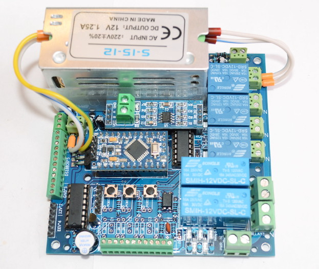
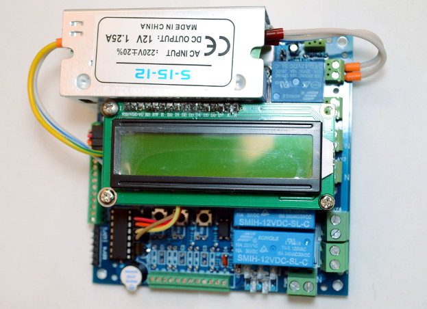
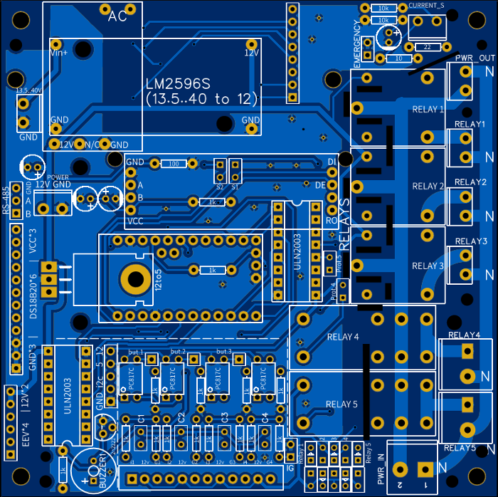

### Older revisions and prototypes

PCB v1.1

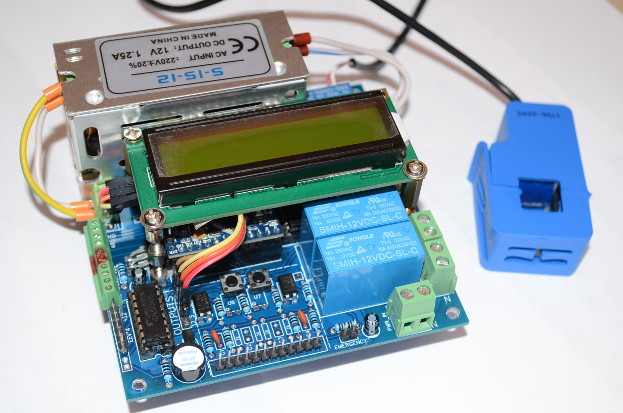
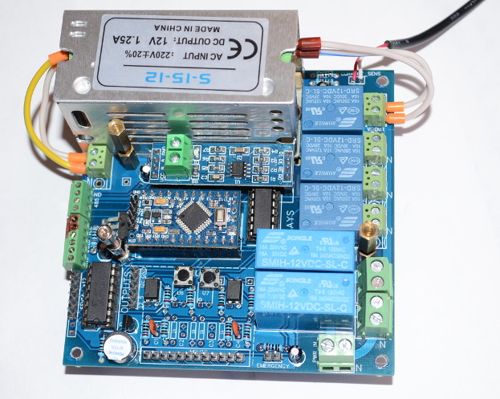

Prototype 2 (PCB v1.0) and EEV development

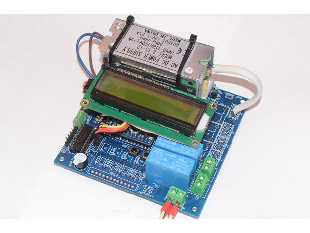
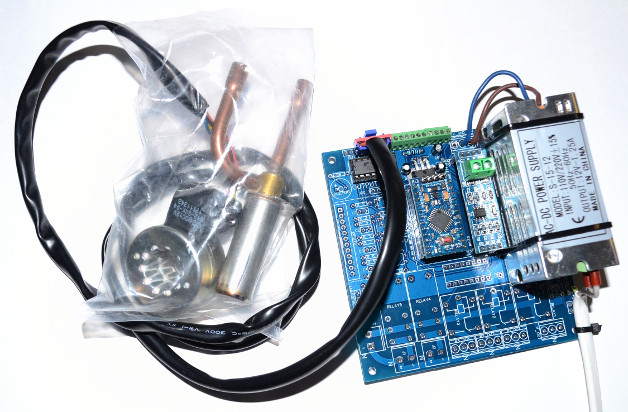
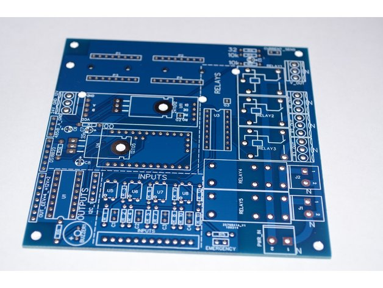

Prototype 1

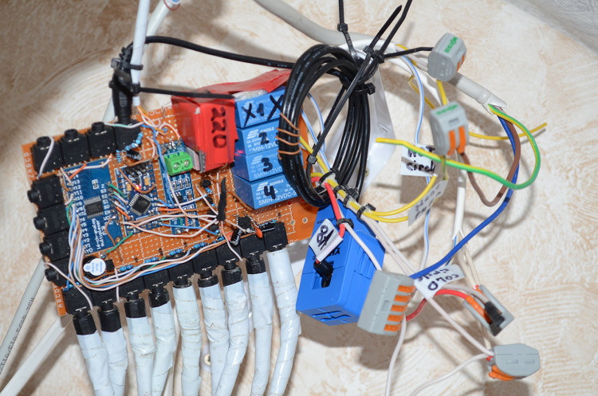

## Author and license

Original design and firmware: gonzho (c) 2018–2019, [github.com/gonzho000/chpc](https://github.com/gonzho000/chpc).
Licensed under the GNU General Public License v3, see [docs/LICENSE](./docs/LICENSE).
